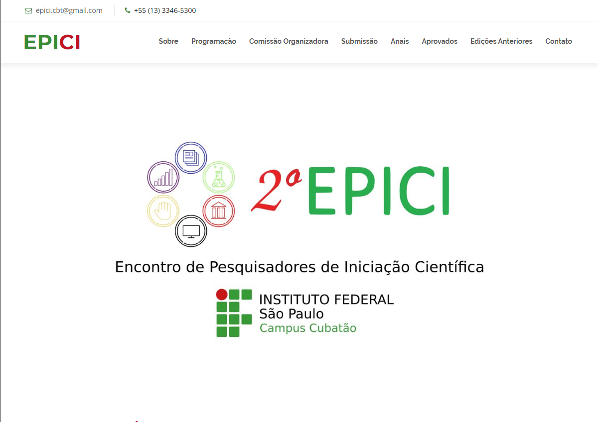
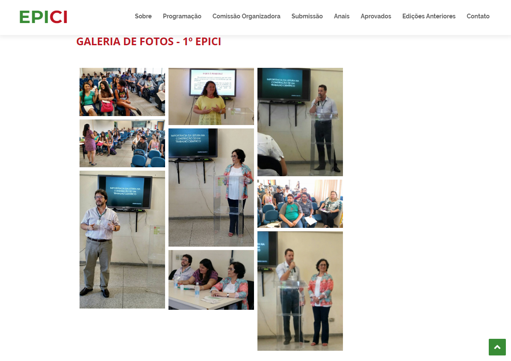
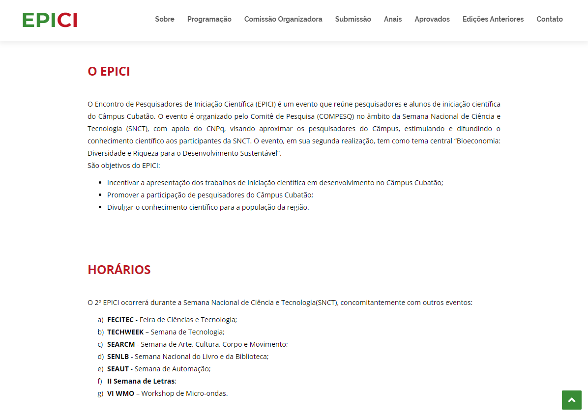

# EPICI
> O Encontro de Pesquisadores de Iniciação Científica (EPICI) é um evento que reúne pesquisadores e alunos de iniciação científica do Câmpus Cubatão. O evento é organizado pelo Comitê de Pesquisa (COMPESQ) no âmbito da Semana Nacional de Ciência e Tecnologia (SNCT), com apoio do CNPq, visando aproximar os pesquisadores do Câmpus, estimulando e difundindo o conhecimento científico aos participantes da SNCT. O evento, em sua segunda realização, tem como tema central “Bioeconomia: Diversidade e Riqueza para o Desenvolvimento Sustentável”.

O site do EPICI foi feito para que os pesquisadores, alunos e professores pudessem acompanhar o evento que iria ocorrer na SNCT. 

## Screenshots

### Página inicial:

### Página de galeria de fotos:

### Página sobre:

